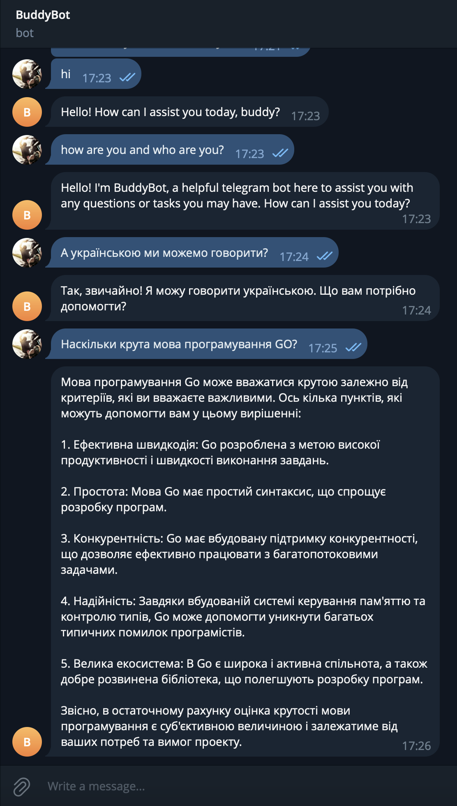

# BuddyBot (t.me/like_buddy_bot)

This bot is designed to provide helpful responses based on user input. You can chat with the bot by sending text messages. The bot will use OpenAI's powerful language model to generate responses.

## Getting Started

## Prerequisites

Before you start, make sure you have the following environment variables set:

- `TELE_TOKEN`: Telegram bot token (required)
- `OPEN_AI_TOKEN`: OpenAI GPT-3.5 Turbo API token (required)

```
export TELE_TOKEN=your_telegram_bot_token
export OPEN_AI_TOKEN=your_openai_token
```

## Installation

- Clone the repository:

```
git clone https://github.com/yourusername/buddyBot.git
cd buddyBot
```

- Build the binary:

```
go build -o buddyBot
```

## Usage

- Start the bot:

```
./buddyBot start
```

- Interact with the bot:

Send a text message to the bot, and it will respond with a generated message.

